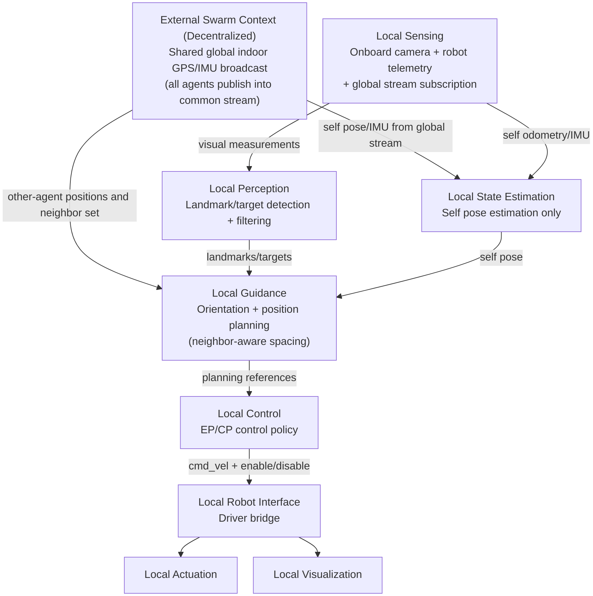

```mermaid
%%{init: {
  "flowchart": {
    "nodeSpacing": 24,
    "rankSpacing": 30,
    "diagramPadding": 4,
    "useMaxWidth": false,
    "htmlLabels": true
  }
}}%%
flowchart TB
  EXT["External Swarm Context (Decentralized)<br/>Shared global indoor GPS/IMU broadcast<br/>(all agents publish into common stream)"]

  S["Local Sensing<br/>Onboard camera + robot telemetry<br/>+ global stream subscription"]
  P["Local Perception<br/>Landmark/target detection + filtering"]
  E["Local State Estimation<br/>Self pose estimation only"]
  G["Local Guidance<br/>Orientation + position planning<br/>(neighbor-aware spacing)"]
  C["Local Control<br/>EP/CP control policy"]
  R["Local Robot Interface<br/>Driver bridge"]
  A["Local Actuation"]
  V["Local Visualization"]

  EXT -->|self pose/IMU from global stream| E
  EXT -->|other-agent positions and neighbor set| G

  S -->|visual measurements| P
  S -->|self odometry/IMU| E
  P -->|landmarks/targets| G
  E -->|self pose| G
  G -->|planning references| C
  C -->|cmd_vel + enable/disable| R
  R --> A
  R --> V
```

